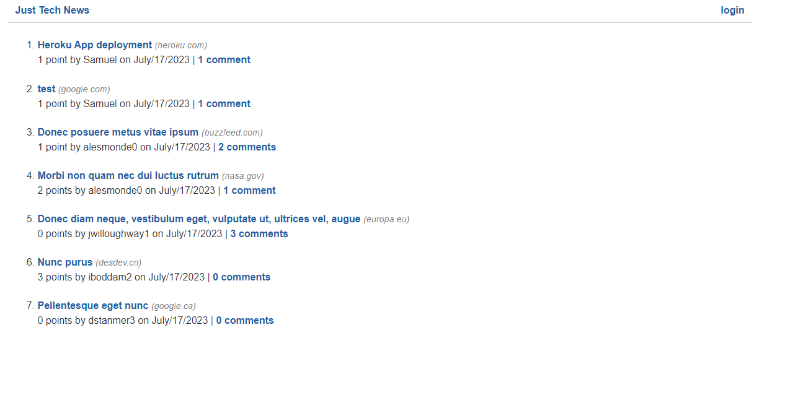

# Python Newsfeed

A refactor back end app to Python

## Description

In this application we use python to refactor the back end side of this application.

## Table of Contents

- [Python Newsfeed](#python-newsfeed)
  - [Description](#description)
  - [Table of Contents](#table-of-contents)
  - [Installation](#installation)
  - [Links](#links)
  - [Usage](#usage)
  - [Credits](#credits)
  - [License](#license)
  - [Contributing](#contributing)
  - [Test](#test)
  - [Questions](#questions)

## Installation

This application runs in the browser.

## Links

Github repository site here: [https://github.com/FranklynSuriel/python-newsfeed](https://github.com/FranklynSuriel/python-newsfeed)

Deployed site here: [https://python-newsfeed2-19135e1c4e1d.herokuapp.com/](https://python-newsfeed2-19135e1c4e1d.herokuapp.com/)

## Usage

Open it in the browser. Click **login** to login or sign up. When you login you will be redirected to **dashboard**, where you can see your post and create new posts. You can click on **comments** to create a comment or upvote the post, also you can click **edit** where you can edit your post, deleted or add a comment. On the homepage you can see all post.

## Credits

Documentation(s) and webpage(s):

- UPENN Bootcamp Continuation Courses
- python
- flask
- SQLAlchemy
- Jinja
- Stack Overflow

## License

This project is licensed under the MIT license.

## Contributing

No contributions guidelines.

## Test

No test available.

## Questions

[github.com/FranklynSuriel](https://github.com/FranklynSuriel)

Questions about this project or to report an issue can be sent to:
fsuriel@gmail.com. Please specify the name of the project in the subject of the email.